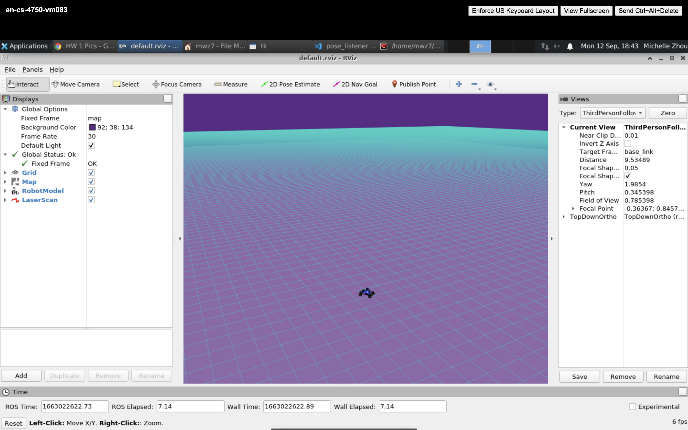
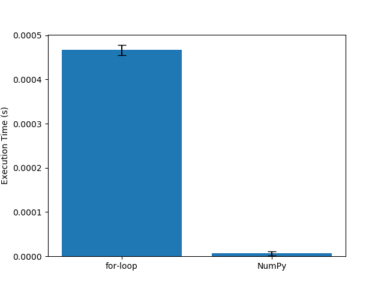
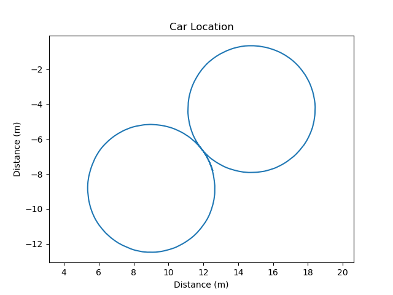
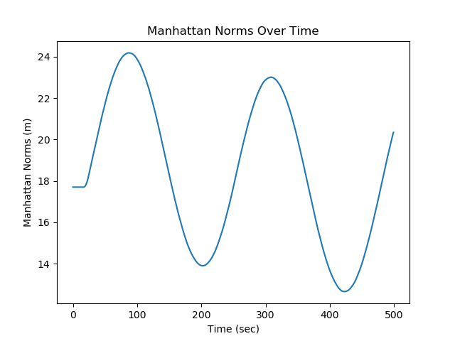
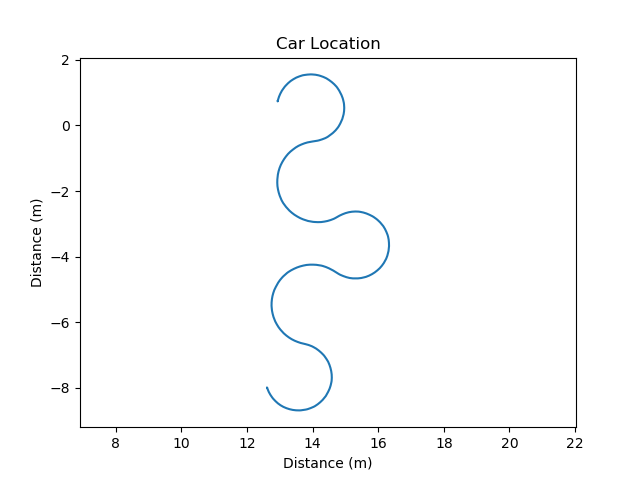
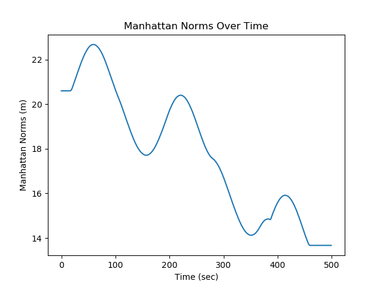

# Project 1: Introduction 

Replace this with your own writeup!

Define in your own words what a node, topic, publisher, and subscriber are and how they relate to each other.
	A node is a type of a program that executes a computation.
	A publisher is a type of node that outputs data across named paths, called topics.
	Those topics are received by anorther type of node: a subscriber.

What is the purpose of a launch file?
	A launch file is for launching multiple nodes at once and setting parameters for run-time.
	
Include the RViz screenshot showing the car.
	

Include your runtime_comparison.png figure for the different norm implementations.
	

Include the locations.png and norms.png figures for the plan figure_8.txt.
	
	

Include the locations.png and norms.png figures for the plan crown.txt.
	
	

Optional for undergrad, mandatory for graduate: Include your own plan file, any code you wrote to generate it, and the resulting locations.png figure.
