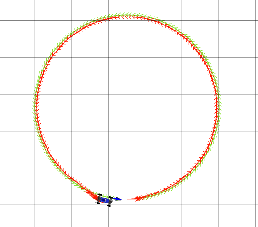
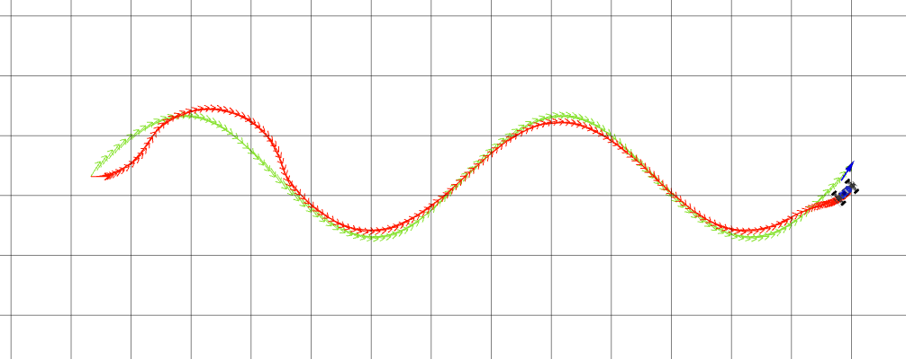
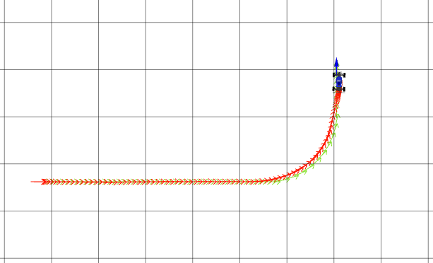

# Project 3: Control 

PID Parameters:
  kp: 2.7
  kd: 1

I started with Kd = 0 and the deafult Kp = 0.5 on a straight line path. I increased Kp until I started seeing slight oscillations.

Then I sent a command for a circular path and increased Kd so that the controller was more responsive and did not over and undershoot as much. 

I tuned parameters to higher values for stronger effects.

MPC Parameters:
  K: 79
  T: 18
  distance_lookahead: 1.1

To tune, I began by making T > 1 so that each rollout sequence was calculated for at least 1 timestep.

Since K coresponds to how many rollouts, i.e. how many lines are shown, I realized I would need a number at least on the order of magnitude of 10s to be able to follow sharper turns.

I then noticed that the car would run into the obstacles because it would see them too late, and consequently increased the lookahead distance. However, I did not increase it too much, or else it would be too far way from the path, and error from the reference path is the performance metric for passing the rostest for Q4.

I limited how much I increased T because at a certain point, the rollout paths would curl back if it were calculated for too many time steps into the future. Since distance is calculated as the displacement between the reference path and last rollout point, having a T too large would tamper with which paths were considered least cost.

The saw path is difficult to track because it has such sharp angle changes a the top of the tooth. To follow the path directly would require a 0 turning radius or a different drivetrain.